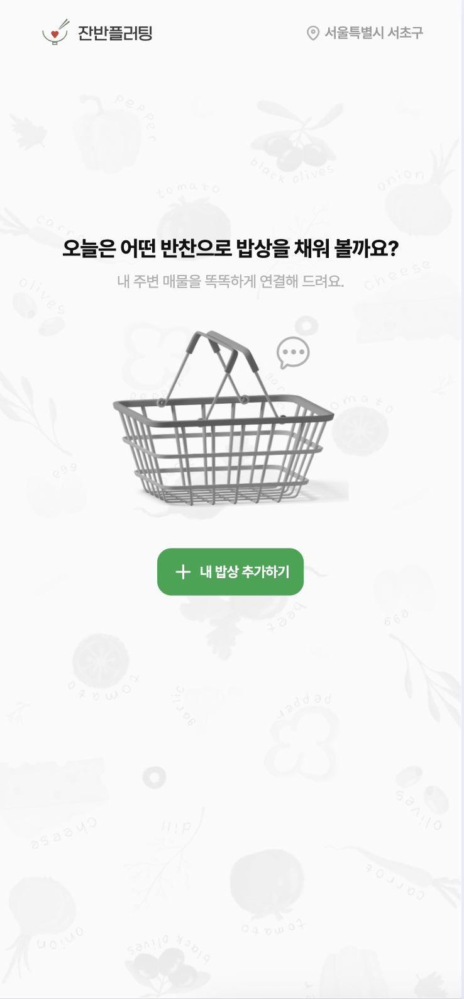
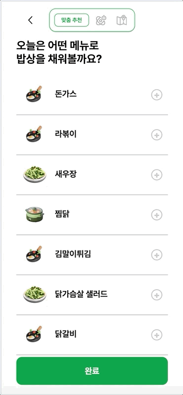
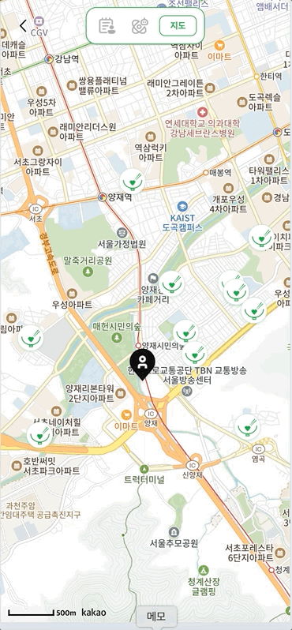
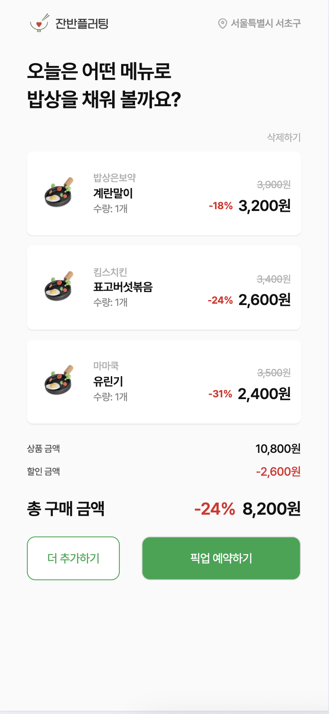
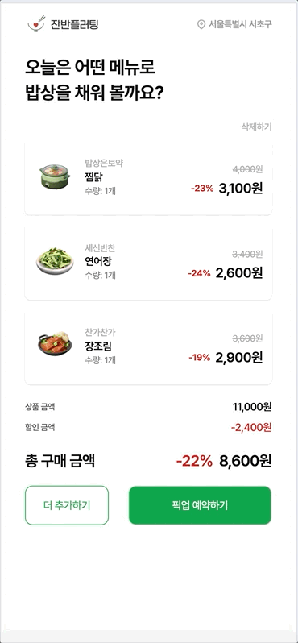
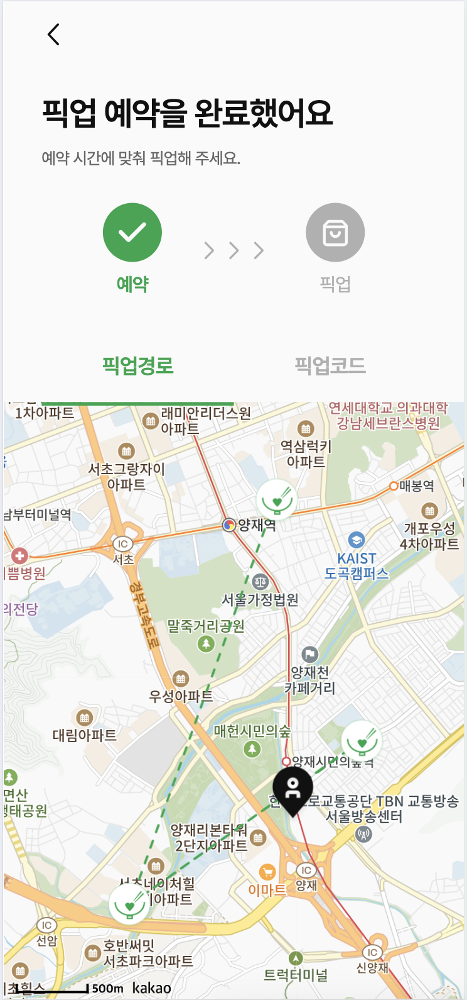
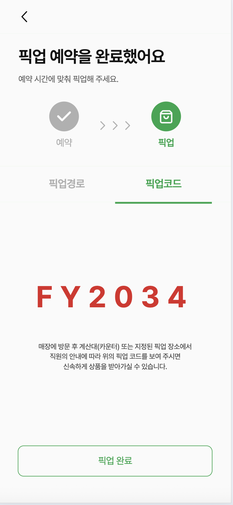

# 🍱 잔반플러팅 Frontend

지역 상점의 잔반 반찬 정보를 기반으로 **위치 기반 매물 탐색, 장바구니 관리, 경로 안내, 맞춤형 추천 UI**를 제공하는 **웹 프론트엔드** 레포지토리입니다.  
React와 SCSS를 활용해 사용자 친화적인 화면을 구현했으며, 서비스는 **Vercel**을 통해 배포되었습니다.

---

## 🚀 Tech Stack

- **React** : UI 라이브러리
- **SCSS** : 스타일 관리
- **React Router DOM** : 라우팅
- **Axios** : API 연동
- **Kakao Map API** : 지도 및 경로 시각화
- **Vercel** : 배포

   

---

## 📂 Project Structure

```text
📦 public
┗ 📂 fonts        # 웹 폰트
📦 src
┣ 📂 api            # 백엔드 / AI 서버 연동 API
┣ 📂 assets         # 이미지, 아이콘 등 정적 리소스
┣ 📂 components     # 공용 UI 컴포넌트
┣ 📂 hooks          # 커스텀 훅
┣ 📂 pages          # 주요 화면 단위 페이지
┣ App.js        # 루트 컴포넌트
┗ index.scss    # 전역 스타일
```
---

## 🛠 주요 기능

### 🍴 메뉴 선택
- 기본 선택 / AI 추천
- 장바구니에 메뉴 담기

### 📍 위치 기반 매물 탐색
- 사용자 위치 권한 요청
- 반경 내 매물 목록 및 마커 표시

### 🛒 장바구니 관리
- 담은 메뉴 확인, 수량 조절, 삭제
- 총액 및 할인 계산

### 🚶 픽업 예약
- 예약 모달 → 예약 완료
- 픽업 코드 발급

### 🗺 경로 안내
- 픽업 코드 기반 예약 조회
- Kakao Map 최적 경로 표시 (Polyline, 마커)

### 💡 알뜰팁 & 추천
- 반찬 활용법 제공
- 레시피 카드 형식 UI
- AI 기반 맞춤 추천

---

## 📸 스크린샷 & 🎬 GIF

| 메인 화면 (📸) | 메뉴 선택 (📸) | AI 추천 (📸) | 지도에서 선택 (📸) |
|----------------|------------------|------------------|-----------|
|   |  |  |  |

| 장바구니 (📸) | 장바구니에서 삭제 (🎬) |
|---------------|---------------------------|
|  |  |

| 픽업 지도 (🎬) | 픽업 코드 (📸) | 알뜰팁 (📸) |
|--------------------|----------------|-------------|
|  |  |  |

---

## 🌐 배포
👉 [서비스 바로가기](https://jf-frontend.vercel.app)